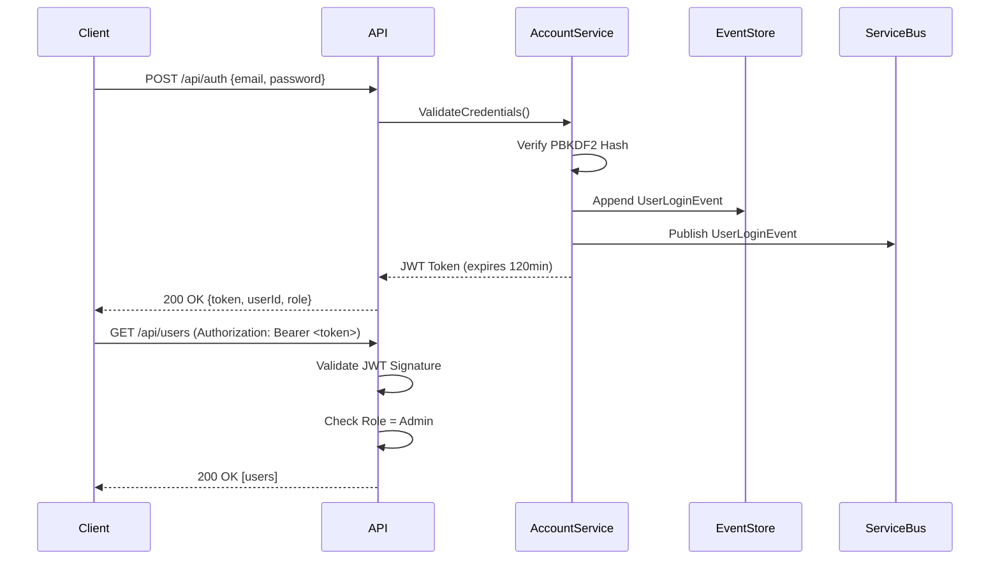
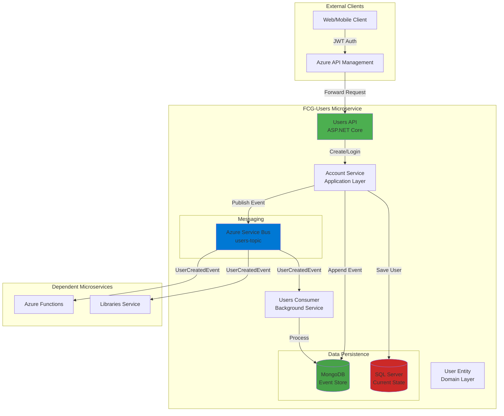

# 👥 FCG-Users - Identity & Authentication Service

> **Microsserviço de Autenticação** - Gerenciamento de identidade, autenticação JWT e Event Sourcing

[](https://dotnet.microsoft.com/)
[](https://blog.cleancoder.com/uncle-bob/2012/08/13/the-clean-architecture.html)
[](https://martinfowler.com/eaaDev/EventSourcing.html)
[](https://martinfowler.com/bliki/DomainDrivenDesign.html)
[](https://jwt.io/)

## 🎯 O que é este projeto?

**FCG-Users** é o **microsserviço de autenticação e gerenciamento de identidade** do ecossistema FCG Games. Implementa autenticação stateless via **JWT**, armazena todo histórico de usuários com **Event Sourcing**, e comunica alterações de estado via **eventos de domínio** para outros microsserviços.

### Responsabilidades Principais
- ✅ Registro e autenticação de usuários
- ✅ Geração e validação de tokens JWT
- ✅ Criptografia de senhas com PBKDF2 (salt + hash)
- ✅ Event Sourcing completo (histórico imutável de usuários)
- ✅ Publicação de eventos para Service Bus (UserCreated, UserDeleted, UserLogin)
- ✅ Autorização baseada em roles (Admin, Common)

---

## 🚀 Tecnologias e Padrões Aplicados

### Stack Técnico Completo
| Tecnologia | Propósito | Conceito Aplicado |
|------------|-----------|-------------------|
| **ASP.NET Core 8** | Web API Framework | RESTful API, Middleware Pipeline |
| **Entity Framework Core 8** | ORM | Code-First, Migrations, DbContext |
| **SQL Server** | Banco Relacional | Persistência de estado atual |
| **MongoDB (Cosmos DB)** | NoSQL Document Store | Event Store (eventos imutáveis) |
| **Azure Service Bus** | Message Broker | Pub/Sub, Topic-based routing |
| **JWT (JSON Web Tokens)** | Autenticação Stateless | Bearer Token, Claims-based Auth |
| **PBKDF2** | Hashing de Senhas | Salted Hash, OWASP Compliance |
| **FluentValidation** | Validação de Requests | Fluent API, Separation of Concerns |
| **Swagger/Swashbuckle** | Documentação de API | OpenAPI 3.0, Interactive Docs |
| **Docker** | Containerização | Imagens multi-stage, Alpine Linux |

### Padrões Arquiteturais Avançados

#### 🏗️ **Clean Architecture (Onion Architecture)**
```
┌─────────────────────────────────────┐
│         API Layer (Controllers)     │  ← Apresentação
├─────────────────────────────────────┤
│    Application Layer (Services)     │  ← Casos de Uso
├─────────────────────────────────────┤
│      Domain Layer (Entities)        │  ← Lógica de Negócio
├─────────────────────────────────────┤
│  Infrastructure (EF, Service Bus)   │  ← Detalhes Técnicos
└─────────────────────────────────────┘
```
- **Dependency Rule**: Dependências apontam para dentro (Domain é independente)
- **Testability**: Domain e Application testáveis sem infraestrutura
- **Framework Independence**: Business logic desacoplada de ASP.NET

#### 📊 **Domain-Driven Design (DDD)**
- **Aggregates**: User como aggregate root
- **Value Objects**: Email, Password (validação no domínio)
- **Domain Events**: UserCreatedEvent, UserLoginEvent
- **Repositories**: Abstração de persistência
- **Services**: Serviços de domínio para lógica complexa

#### 🔄 **Event Sourcing**
- **Event Store**: MongoDB armazena TODOS os eventos de usuários
- **Immutable Events**: Histórico completo de criação, login, deleção
- **Audit Trail**: Rastreabilidade total de alterações
- **Temporal Queries**: Possibilidade de reconstruir estado em qualquer momento

#### 📨 **Event-Driven Architecture (EDA)**
- **Domain Events**: Fatos ocorridos no domínio (UserCreated)
- **Service Bus Integration**: Eventos publicados em topics
- **Eventual Consistency**: Outros serviços atualizam-se assincronamente
- **Choreography**: Cada serviço reage a eventos independentemente

#### 🔐 **CQRS (Command Query Responsibility Segregation)**
- **Commands**: Operações de escrita (CreateUser, DeleteUser)
- **Queries**: Operações de leitura (GetUser, GetUsers)
- **Separation**: Modelos diferentes para escrita (Event Store) e leitura (SQL)

---

## 📐 Estrutura do Projeto

```
FCG-Users/
├── FCG-Users.Api/              # Controllers, Middleware, Program.cs
│   ├── Controllers/
│   │   └── UserController.cs   # Endpoints REST
│   ├── Middleware/
│   │   └── ExceptionMiddleware.cs
│   └── Program.cs              # DI Container, Pipeline
│
├── FCG-Users.Application/      # Casos de Uso, DTOs, Validações
│   ├── DTOs/
│   │   ├── CreateUserRequest.dto.cs
│   │   └── LoginRequest.dto.cs
│   ├── Services/
│   │   └── AccountService.cs   # Lógica de autenticação
│   └── Validators/
│       └── CreateUserValidator.cs
│
├── FCG-Users.Domain/           # Entidades, Value Objects, Interfaces
│   ├── Entities/
│   │   └── User.cs             # Aggregate Root
│   ├── ValueObjects/
│   │   ├── Email.cs
│   │   └── Password.cs
│   ├── Events/
│   │   └── UserCreatedEvent.cs
│   └── Interfaces/
│       └── IUserRepository.cs
│
├── FCG-Users.Infrastructure/   # EF Core, Service Bus, MongoDB
│   ├── Data/
│   │   ├── AppDbContext.cs
│   │   └── Migrations/
│   ├── Repositories/
│   │   └── UserRepository.cs
│   ├── EventStore/
│   │   └── MongoEventStore.cs
│   └── Messaging/
│       └── ServiceBusPublisher.cs
│
└── FCG-Users.Consumer/         # Background Service (Event Consumer)
    └── Workers/
        └── UserEventsConsumer.cs
```

---

## ⚙️ Configuração e Execução

### Pré-requisitos
- .NET 8 SDK
- SQL Server (local ou Azure)
- MongoDB (local, Docker ou Cosmos DB)
- Azure Service Bus namespace

### Configuração (appsettings.json)

```json
{
  "ConnectionStrings": {
    "DefaultConnection": "Server=localhost;Database=UsersDb;Trusted_Connection=True;"
  },
  "ServiceBus": {
    "ConnectionString": "<service-bus-connection-string>",
    "Topics": {
      "Users": "users-topic"
    },
    "Subscriptions": {
      "Users": "users-subscription"
    }
  },
  "MongoSettings": {
    "ConnectionString": "mongodb://localhost:27017",
    "Database": "EventStoreDb",
    "Collection": "Events"
  },
  "Jwt": {
    "Key": "9y4XJg0aTphzFJw3TvksRvqHXd+Q4VB8f7ZvU08N+9Q=",
    "Issuer": "FGC-Users",
    "Audience": "API",
    "ExpiresMinutes": 120
  }
}
```

### Executar Migrations
```powershell
cd FCG-Users.Api
dotnet ef database update
```

### Executar API
```powershell
cd FCG-Users.Api
dotnet run
# API disponível em: https://localhost:7001
```

### Executar Consumer
```powershell
cd FCG-Users.Consumer
dotnet run
```

### Testar no Swagger
Navegue para: `https://localhost:7001/swagger`

---

## 🔐 Autenticação e Autorização

### Fluxo de Autenticação JWT



### Endpoints e Autorização

| Método | Endpoint | Autorização | Descrição |
|--------|----------|-------------|-----------|
| POST | `/api` | [AllowAnonymous] | Criar usuário (registro) |
| POST | `/api/auth` | [AllowAnonymous] | Login (obter JWT) |
| GET | `/api` | [Authorize(Roles="Admin")] | Listar todos os usuários |
| GET | `/api/{id}` | [Authorize(Roles="Admin")] | Obter usuário por ID |
| DELETE | `/api/{id}` | [Authorize(Roles="Admin")] | Deletar usuário |

### Exemplo de Request (Login)

```bash
curl -X POST https://localhost:7001/api/auth \
  -H "Content-Type: application/json" \
  -d '{
    "email": "admin@fcg.com",
    "password": "Senha@123"
  }'
```

**Response**:
```json
{
  "token": "eyJhbGciOiJIUzI1NiIsInR5cCI6IkpXVCJ9...",
  "userId": "3fa85f64-5717-4562-b3fc-2c963f66afa6",
  "role": "Admin",
  "expiresAt": "2026-01-09T14:30:00Z"
}
```

---

## 🏛️ Arquitetura - Diagrama Mermaid



---

## 🧪 Padrões de Código Exemplificados

### Value Object (Email)
```csharp
public class Email : ValueObject
{
    public string Value { get; private set; }
    
    private Email(string value) => Value = value;
    
    public static Email Create(string value)
    {
        if (string.IsNullOrWhiteSpace(value))
            throw new DomainException("Email não pode ser vazio");
            
        if (!Regex.IsMatch(value, @"^[^@\s]+@[^@\s]+\.[^@\s]+$"))
            throw new DomainException("Email inválido");
            
        return new Email(value);
    }
    
    protected override IEnumerable<object> GetEqualityComponents()
    {
        yield return Value;
    }
}
```

### Event Sourcing (Append Event)
```csharp
public async Task<User> CreateUserAsync(CreateUserRequest request)
{
    var user = User.Create(request.Email, request.Password, request.Role);
    
    // 1. Salvar no SQL (estado atual)
    await _repository.AddAsync(user);
    
    // 2. Append no Event Store (histórico imutável)
    var @event = new UserCreatedEvent
    {
        UserId = user.Id,
        Email = user.Email.Value,
        Role = user.Role,
        CreatedAt = DateTime.UtcNow
    };
    
    var events = await _eventStore.GetEventsAsync(user.Id.ToString());
    await _eventStore.AppendAsync(user.Id.ToString(), events.Count, @event);
    
    // 3. Publicar evento no Service Bus
    await _publisher.PublishAsync(@event);
    
    return user;
}
```

---

## 📊 Observabilidade

### Logs Estruturados
```csharp
_logger.LogInformation(
    "Usuário criado | UserId: {UserId} | Email: {Email} | CorrelationId: {CorrelationId}",
    user.Id,
    user.Email.Value,
    HttpContext.TraceIdentifier
);
```

### Métricas Importantes
- Taxa de sucesso de login
- Tempo de resposta de autenticação
- Eventos publicados vs. eventos processados
- Erros de validação

---

## 🎓 Conceitos Avançados Demonstrados

### **Idempotência**
Events no Event Store incluem versionamento para prevenir duplicatas:
```csharp
await _eventStore.AppendAsync(streamId, expectedVersion, @event);
```

### **Eventual Consistency**
Após criar usuário, outros serviços atualizam-se assincronamente via eventos.

### **Defense in Depth (Segurança)**
- PBKDF2 com salt aleatório (10.000 iterations)
- JWT com assinatura HMAC-SHA256
- Validação em múltiplas camadas (FluentValidation + Data Annotations)
- Authorization Policies (Admin vs Common)

### **Bounded Context Isolation**
Users é um bounded context independente - não conhece detalhes de Games, Payments, Libraries.

---

## 📚 Referências Técnicas

- [Clean Architecture (Uncle Bob)](https://blog.cleancoder.com/uncle-bob/2012/08/13/the-clean-architecture.html)
- [Event Sourcing (Martin Fowler)](https://martinfowler.com/eaaDev/EventSourcing.html)
- [DDD Reference (Eric Evans)](https://www.domainlanguage.com/ddd/reference/)
- [JWT Best Practices (RFC 8725)](https://datatracker.ietf.org/doc/html/rfc8725)
- [PBKDF2 (OWASP)](https://cheatsheetseries.owasp.org/cheatsheets/Password_Storage_Cheat_Sheet.html)

---

## Fluxo de Eventos
1. **Criação/remoção de usuários** gera eventos (`UserCreated`, `UserRemoved`).  
2. Os eventos são persistidos no **MongoDB (Event Store)**.  
3. Os eventos são publicados no **Azure Service Bus (users-topic)**.  
4. Outros microsserviços (como **Libraries**) consomem esses eventos:
   - Se um **User** for removido → todas as bibliotecas vinculadas a ele são apagadas.

---

## Observabilidade
- **Logs estruturados** com `CorrelationId` para rastrear requisições e eventos.  
- **Swagger** para documentação e testes de endpoints.  
- **GlobalExceptionMiddleware** para captura e padronização de erros.

---

## Competências demonstradas
- Microsserviços  
- Event Sourcing  
- CQRS  
- Event-Driven Architecture (EDA)  
- Azure Service Bus  
- MongoDB (Event Store)  
- Entity Framework Core  
- .NET 8 / ASP.NET Core  
- Repository Pattern  
- Dependency Injection  
- Middleware personalizado  
- Idempotência  
- Docker  
- Swagger

---

## Objetivo
Este projeto foi desenvolvido como parte de um portfólio pessoal para demonstrar:
- Conhecimento em **arquitetura de microsserviços**.  
- Aplicação prática de **event sourcing** e **mensageria assíncrona**.  
- Uso de **padrões de projeto** e boas práticas de engenharia de software.  

